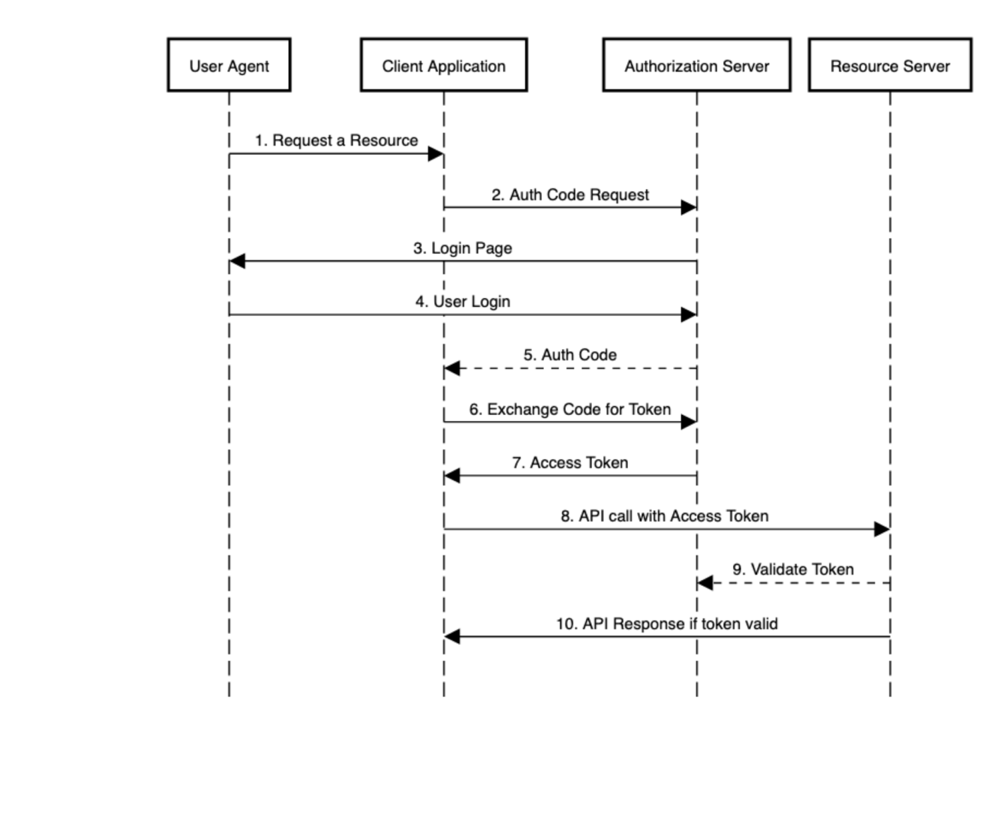

# resource-server

Пример простого сервера предоставления ресурсов.
В данном сервере авторизация заточена конкретно под наш сервер авторизации Oauth2.0 по адресу https://demo.trusted.plus

## Install
1. git clone
2. IntellIJ IDEA -> open project
3. mvn clean install
4. copy war file  **resource-server\target\resource-server-0.0.1-SNAPSHOT.war** to **$JBOSS_HOME\standalone\deployments**
5. run server:   
   linux - **$JBOSS_HOME\bin\standalone.sh**;  
   windows - **$JBOSS_HOME\bin\standalone.bat**;

Обычная схема в/д с сервером ресурсов выглядит так:


В нашем случае пока что мы сделаем это вручную с 1-7 шаг.  
Что бы получить доступ к серверу ресурсов необходимо: 
1. Зарегистрировать ваше приложение в сервисе demo.trusted.plus;  
   Мои приложения -> Нажать плюс в правом нижнем углу -> Выбрать тип приложения -> Заполнить необходимы поля -> 
   Нажать создать -> Перейти в созданное приложение и сохранить куда нить clientId, а так же secret
2. Сохранить данные clientId и secret вашего приложения
   
3. Получить access_token отправив запрос на 
   https://demo.trusted.plus/idp/sso/oauth/token?grant_type=password&username=test&password=qwerty123 где  
   * **username** = логин для входа в ваш личный кабинет t.trusted.plus,  
   * **password** = пароль от личного кабинета t.trusted.plus,  
   * **Authorization**: Basic Auth : **username**=clientId, **password**=secret из пункта 2.
   Придет ответ в формате json подобного вида:
   ```json 
    {
      "access_token": "9f7b4180-e939-48da-9d89-5bc1171533db",
      "token_type": "bearer",
      "refresh_token": "50e3aaca-a3b5-4ca2-a620-81475fef4942",
      "expires_in": 17,
      "scope": "userprofile"
   }
   ```
4. Отправить запрос http://localhost:8082/joke/random
   Authorization: **Bearer token** вставить токен, полученный ранее.
